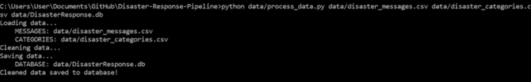
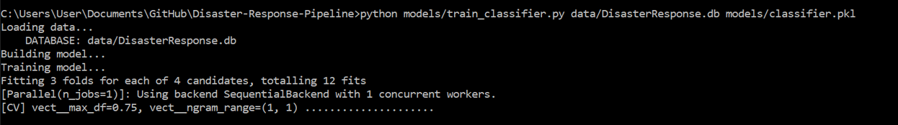

# Project: Disaster Response Pipeline


### Table of Contents

- [Overview](#overview)
- [Components](#components)
  - [ETL Pipeline](#etl)
  - [ML Pipeline](#ml)
  - [Web App](#flask)
- [Running](#run)
  - [Data Cleaning](#cleaning)
  - [Training Classifier](#training)
  - [Starting the Web App](#starting)
- [Files](#files)
- [Software Requirements](#sw)
- [Credits and Acknowledgements](#credits)


<a id='overview'></a>
## 1. Overview and motivation of the project

The aim of the project is to build a NL Processing tool that categorize messages.
The messages contain tweets and messages from real-life disaster from Figure Eight. 

The included jupyter notebook `Disaster-Response-Pipeline.ipynb`  will help you to understand how the model works step by step.


<a id='components'></a>
## 2. Components of the project

The project consists of three components

<a id='etl'></a>
### 2.1. ETL Pipeline

File _data/process_data.py_ contains data cleaning pipeline that:
- Loads the necessary data sets `messages` and `categories` 
- Merges the two datasets
- Cleans the data
- Stores it in a **SQLite database**

<a id='ml'></a>
### 2.2. ML Pipeline

File _models/train_classifier.py_ contains machine learning pipeline that:
- Loads data from the **SQLite database**
- Splits the data into training and testing sets
- Builds a text processing and machine learning pipeline
- Trains and tunes a model using GridSearchCV
- Outputs result on the test set
- Exports the final model as a Python pickle file

<a id='flask'></a>
### 2.3. Flask Web App

Starting from the `app` folder, the users can enter their query, i.e., a request message sent during a natural disaster, e.g. _"All houses are on fire!"_.


<a id='run'></a>
## 3. Running and instructions

There are three steps to get up and runnning with the web app.
Otherwise you can start the app with the trained model in the repository.

<a id='cleaning'></a>
### 3.1. Data Cleaning

**Go to the project directory** and the run the following command:

```bat
python data/process_data.py data/disaster_messages.csv data/disaster_categories.csv data/DisasterResponse.db
```


The first two arguments are input data and the third argument is the SQLite Database in which we want to save the cleaned data. The ETL pipeline is in _process_data.py_.


<a id='training'></a>
### 3.2. Training Classifier

After the data cleaning process, run this command **from the project directory**:

```bat
python models/train_classifier.py data/DisasterResponse.db models/classifier.pkl
```



This will use cleaned data to train the model, improve the model with grid search and saved the model to a pickle file (_classifer.pkl_).


<a id='starting'></a>
### 3.3. Starting the web app

Now you can see the prediction in real time in the Flask web app.

**Go to the app directory** and run the following command:

```bat
python run.py
```

Go to the following adress in your browser:
```bat
http://localhost:3001/
```

<a id='files'></a>
## 4. Files in the repository

````bat
│   Disaster-Response-Pipeline.ipynb
│   README.md
├───app
│   │   run.py
│   └───templates
│           go.html
│           master.html
├───data
│       DisasterResponse.db
│       disaster_categories.csv
│       disaster_messages.csv
│       process_data.py
├───img
│       analyze_message.png
│       disaster_repsonse.png
│       dist_categories.png
│       dist_genres.png
│       process_data.png
│       train_model.png
└───models
        classifier.pkl
        train_classifier.py
````

<a id='sw'></a>
## 5. Software Requirements

**Python 3**

Libraries:
- sys
- json
- re
- pandas 
- sqlite3 
- plotly
- numpy 
- pickle
- ntlk
- flask
- sklearn


<a id='credits'></a>
## 6. Credits and Acknowledgements

This Project is part of Data Science Nanodegree Program by Udacity.