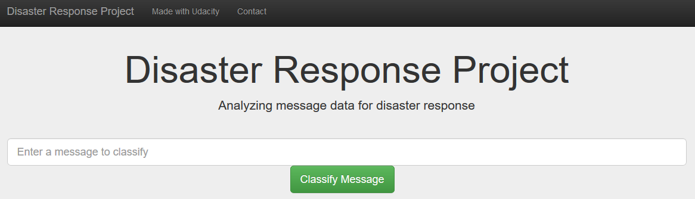
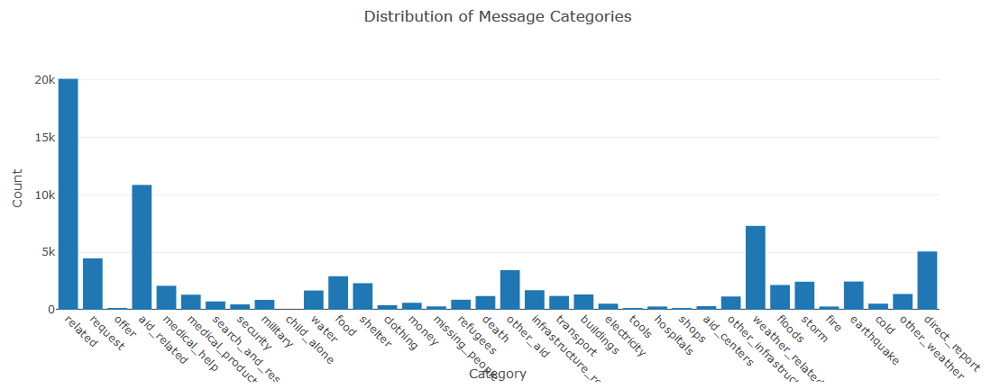
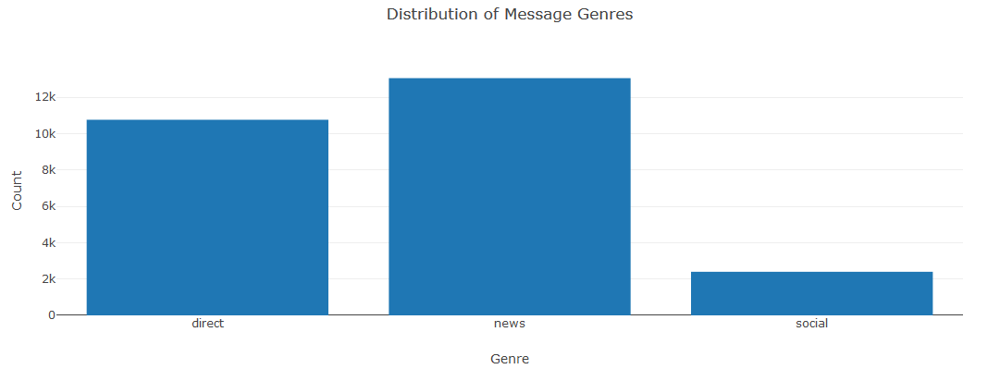

# Project: Disaster Response Pipeline



### Table of Contents

- [Overview](#overview)
- [Components](#components)
  - [ETL Pipeline](#etl)
  - [ML Pipeline](#ml)
  - [Web App](#flask)
- [Running](#run)
  - [Data Cleaning](#cleaning)
  - [Training Classifier](#training)
  - [Starting the Web App](#starting)
- [Files](#files)
- [Software Requirements](#sw)
- [Credits and Acknowledgements](#credits)


<a id='overview'></a>
## 1. Overview and motivation of the project

The aim of the project is to build a NL Processing tool that categorize new messages.  
The training messages contain tweets and messages from real-life disasters from Figure Eight. 

The included jupyter notebook `Disaster-Response-Pipeline.ipynb`  will help you to  
understand how the model works step by step.


<a id='components'></a>
## 2. Components of the project

The project consists of three components.

<a id='etl'></a>
### 2.1. ETL Pipeline

The file _data/process_data.py_ contains the data cleaning pipeline that:
- Loads the necessary data sets messages and categories 
- Merges the two datasets
- Cleans the data
- Stores it in a SQLite database

<a id='ml'></a>
### 2.2. ML Pipeline

The file _models/train_classifier.py_ contains the machine learning pipeline that:
- Loads data from the SQLite database
- Splits the data into training and testing sets
- Builds a text processing and machine learning pipeline
- Trains and tunes a model using GridSearchCV
- Outputs the f1 score, precision and overall accuracy of the model
- Exports the final model as a Python pickle file

<a id='flask'></a>
### 2.3. Flask Web App

The file _app/run.py_ starts the web app, so that the users can enter their query.  
 E.g. a request message sent during a natural disaster (_"All houses are on fire!"_).


<a id='run'></a>
## 3. Running and instructions

There are three steps to get up and runnning with the web app.  
Otherwise you can start the app with the trained model in the repository.

<a id='cleaning'></a>
### 3.1. Data Cleaning

Go to the project directory and the run the following command.  
The first two arguments are input data and the third argument is the SQLite Database in which we want to save the cleaned data.

```bat
python data/process_data.py data/disaster_messages.csv data/disaster_categories.csv data/DisasterResponse.db
```


<a id='training'></a>
### 3.2. Training Classifier

After the data cleaning process, run this command from the project directory.  
This will use the cleaned data to train the model, improve the model with CVGridSearch and save the model to a pickle file.

```bat
python models/train_classifier.py data/DisasterResponse.db models/classifier.pkl
```


The f1 score, precision and recall for the test set is outputted for each category:

```bat
                        precision    recall  f1-score   support
               related       0.86      0.94      0.90      4045
               request       0.75      0.64      0.69       909
                 offer       0.00      0.00      0.00        20
           aid_related       0.69      0.78      0.73      2133
          medical_help       0.62      0.35      0.45       427
      medical_products       0.65      0.33      0.43       248
     search_and_rescue       0.69      0.15      0.25       145
              security       0.33      0.01      0.02       102
              military       0.57      0.33      0.42       162
           child_alone       0.00      0.00      0.00         0
                 water       0.78      0.73      0.75       332
                  food       0.77      0.81      0.79       549
               shelter       0.78      0.66      0.71       491
              clothing       0.66      0.50      0.57        74
                 money       0.48      0.25      0.33       121
        missing_people       0.33      0.02      0.04        49
              refugees       0.58      0.24      0.34       173
                 death       0.77      0.48      0.59       229
             other_aid       0.49      0.24      0.33       699
infrastructure_related       0.48      0.11      0.18       351
             transport       0.66      0.23      0.34       248
             buildings       0.59      0.42      0.49       263
           electricity       0.57      0.32      0.41       104
                 tools       0.00      0.00      0.00        30
             hospitals       0.67      0.09      0.16        65
                 shops       0.00      0.00      0.00        24
           aid_centers       0.00      0.00      0.00        62
  other_infrastructure       0.40      0.07      0.12       226
       weather_related       0.79      0.74      0.76      1488
                floods       0.85      0.57      0.68       436
                 storm       0.68      0.64      0.66       473
                  fire       0.78      0.34      0.48        61
            earthquake       0.86      0.75      0.80       492
                  cold       0.73      0.41      0.53       115
         other_weather       0.53      0.16      0.25       301
         direct_report       0.66      0.55      0.60      1030
```

<a id='starting'></a>
### 3.3. Starting the web app

Go to the app directory and run the following command:

```bat
python run.py
```

Start your browser and go tothe follwiung adress:
```bat
http://localhost:3001/
```
The start page will show up - and a message for classification can be typed in.  
In addtion two statistics about the distribution of the messages will be shown.





<a id='files'></a>
## 4. Files in the repository

````bat
│   Disaster-Response-Pipeline.ipynb
│   README.md
├───app
│   │   run.py
│   └───templates
│           go.html
│           master.html
├───data
│       DisasterResponse.db
│       disaster_categories.csv
│       disaster_messages.csv
│       process_data.py
├───img
│       analyze_message.png
│       disaster_repsonse.png
│       dist_categories.png
│       dist_genres.png
│       process_data.png
│       train_model.png
└───models
        classifier.pkl
        train_classifier.py
````

<a id='sw'></a>
## 5. Software Requirements

**Python 3**

Libraries:
- sys
- json
- re
- pandas 
- sqlite3 
- plotly
- numpy 
- pickle
- ntlk
- flask
- sklearn


<a id='credits'></a>
## 6. Credits and Acknowledgements

This Project is part of Data Science Nanodegree Program by Udacity.